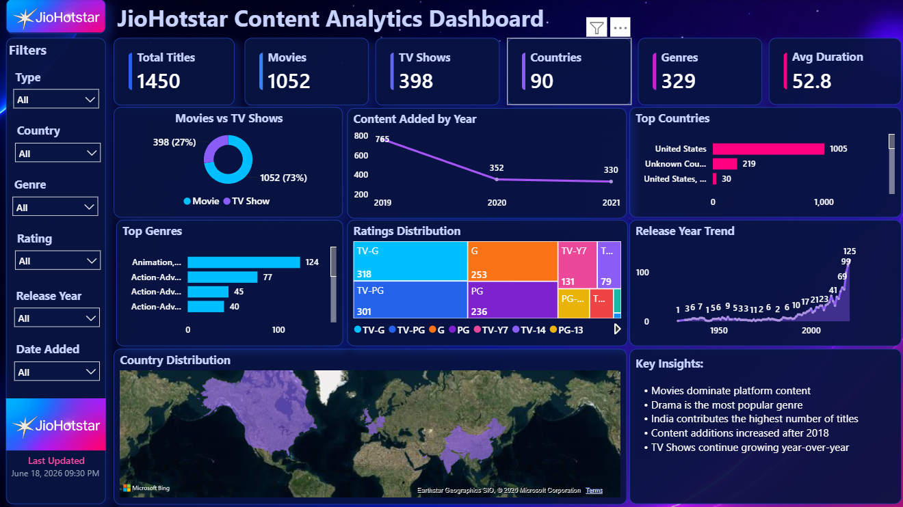

# JioHotstar Content Analytics Dashboard

## Overview

JioHotstar Content Analytics Dashboard is an interactive data analytics project built using Power BI, Python, and Streamlit.

The dashboard provides insights into content distribution, genre popularity, ratings, country-wise availability, release trends, and platform growth across the JioHotstar content catalog.

---

## Features

* Content Distribution Analysis
* Movies vs TV Shows Comparison
* Genre Popularity Analysis
* Ratings Distribution Analysis
* Country-wise Content Analysis
* Release Year Trend Analysis
* Interactive Dashboard Filters
* KPI Monitoring

---

## Dashboard Metrics

* Total Titles
* Total Movies
* Total TV Shows
* Total Countries
* Total Genres
* Average Duration

---

## Visualizations

### Movies vs TV Shows

Analyze the proportion of Movies and TV Shows available on the platform.

### Content Added by Year

Track content growth and additions over time.

### Top Countries

Identify countries contributing the highest number of titles.

### Top Genres

Discover the most popular content genres.

### Ratings Distribution

Analyze content ratings across the platform.

### Release Year Trend

Monitor content production trends by release year.

### Country Distribution Map

Visualize global content availability using an interactive world map.

---

## Tools Used

* Excel
* SQL
* Power BI
* Python
* Numpy
* Streamlit
* Plotly
* Pillow
* Pandas

---

## Business Insights

* Movies dominate the platform content library.
* TV Shows continue growing year-over-year.
* The United States contributes the highest number of titles.
* Drama and Animation are among the most popular genres.
* Significant content additions occurred after 2018.
* Content is distributed across 90+ countries worldwide.

---

## Technologies & Libraries

* Power BI
* Python
* Pandas
* Plotly 
* Streamlit

---

## Deployment

Streamlit Cloud

---

## Dashboard Preview

---
